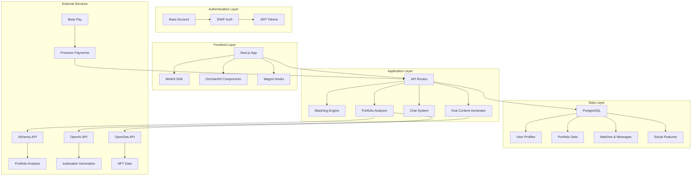

# Design Document

## Overview

Base Dating is a crypto-native dating platform that leverages blockchain data to create meaningful connections between crypto enthusiasts. The system analyzes users' on-chain portfolios, DeFi activity, and NFT collections to calculate compatibility scores and suggest matches based on shared crypto interests and strategies.

The MVP architecture focuses on scalability, privacy, and user experience while integrating seamlessly with the Base ecosystem through OnchainKit, MiniKit, and Base Account authentication.

## Architecture

### High-Level System Architecture



### Technology Stack

**Frontend:**
- Next.js 14 with App Router for server-side rendering and optimal performance
- TypeScript for type safety and developer experience
- Tailwind CSS + Framer Motion for responsive design and animations
- MiniKit SDK for Base App integration and native mobile experience
- OnchainKit for wallet connections and Base ecosystem integration

**Backend:**
- Next.js API Routes for serverless backend functionality
- Prisma ORM with PostgreSQL for robust data management
- Zustand for client-side state management
- React Query for efficient data fetching and caching

**Blockchain Integration:**
- Wagmi + Viem for Ethereum/Base blockchain interactions
- Base Account for seamless wallet authentication
- OnchainKit components for transaction handling
- Base Pay for premium subscription payments

**External APIs:**
- Alchemy API for comprehensive portfolio analysis
- OpenAI API for AI-generated icebreakers and content
- OpenSea API for NFT collection data
- Push Protocol for real-time notifications

## Components and Interfaces

### Core Components

#### 1. Authentication System

**BaseAccountAuth Component:**
```typescript
interface AuthState {
  user: User | null
  isAuthenticated: boolean
  walletAddress: string | null
  farcasterProfile: FarcasterProfile | null
}

interface AuthActions {
  connectWallet: () => Promise<void>
  signInWithFarcaster: () => Promise<void>
  logout: () => void
  refreshProfile: () => Promise<void>
}
```

**Features:**
- Base Account integration for seamless wallet connection
- SIWF authentication with Farcaster profile linking
- Automatic session management with JWT tokens
- Wallet address verification and ENS/Basename resolution

#### 2. Portfolio Analysis Engine

**PortfolioAnalyzer Service:**
```typescript
interface PortfolioData {
  totalValue: number
  topTokens: TokenHolding[]
  nftCollections: NFTCollection[]
  defiProtocols: DeFiProtocol[]
  riskScore: number
  diversityScore: number
  activityScore: number
}

interface AnalysisResult {
  cryptoPersonality: CryptoPersonality
  portfolioTier: PortfolioTier
  compatibilityFactors: CompatibilityFactor[]
  privacyLevel: PrivacyLevel
}
```

**Features:**
- Multi-chain portfolio analysis (Base, Ethereum, Polygon)
- Privacy-first approach - no exact amounts stored
- Real-time DeFi protocol detection
- NFT collection categorization and rarity analysis
- Behavioral pattern recognition for personality typing

#### 3. Smart Matching Algorithm

**MatchingEngine Service:**
```typescript
interface CompatibilityScore {
  overall: number // 0-1 scale
  tokenSimilarity: number // 60% weight
  defiCompatibility: number // 25% weight
  nftAlignment: number // 10% weight
  activitySync: number // 5% weight
  reasoning: string[]
}

interface MatchCandidate {
  user: User
  compatibilityScore: CompatibilityScore
  sharedInterests: SharedInterest[]
  icebreakers: string[]
}
```

**Algorithm Logic:**
1. **Token Similarity (60%):** Compare top 10 tokens by percentage allocation
2. **DeFi Compatibility (25%):** Analyze shared protocols and strategies
3. **NFT Alignment (10%):** Match collection preferences and art styles
4. **Activity Sync (5%):** Compare transaction timing and frequency patterns

#### 4. AI-Powered Icebreaker System

**IcebreakerGenerator Service:**
```typescript
interface IcebreakerContext {
  sharedTokens: string[]
  commonProtocols: string[]
  nftOverlap: string[]
  marketEvents: MarketEvent[]
  personalityTypes: CryptoPersonality[]
}

interface GeneratedIcebreaker {
  message: string
  category: 'portfolio' | 'defi' | 'nft' | 'market' | 'personality'
  confidence: number
  humor_level: 'light' | 'moderate' | 'spicy'
}
```

**Features:**
- Context-aware conversation starters based on shared crypto activities
- Market event integration for timely conversation topics
- Personality-based humor calibration
- A/B testing for icebreaker effectiveness

#### 5. Real-Time Chat System

**ChatInterface Component:**
```typescript
interface ChatMessage {
  id: string
  senderId: string
  content: string
  type: MessageType
  timestamp: Date
  reactions?: Reaction[]
  cryptoGift?: CryptoGift
}

interface ChatFeatures {
  realTimeMessaging: boolean
  cryptoGifts: boolean
  portfolioSharing: boolean
  challengeInvites: boolean
  voiceMessages: boolean
}
```

**Features:**
- WebSocket-based real-time messaging
- Crypto gift sending (small amounts for fun)
- Portfolio snippet sharing with privacy controls
- Challenge invitations for couples
- Voice message support for mobile users

#### 6. Viral Content Generator

**ViralContentEngine Service:**
```typescript
interface ViralContent {
  type: 'compatibility_report' | 'portfolio_roast' | 'success_story' | 'meme'
  content: string
  imageUrl?: string
  shareableUrl: string
  socialPlatforms: SocialPlatform[]
}

interface ContentTemplate {
  template: string
  variables: Record<string, any>
  style: 'humorous' | 'romantic' | 'educational' | 'meme'
}
```

**Features:**
- Automated compatibility report generation
- AI-powered portfolio roasting with humor
- Success story amplification system
- Meme generation based on market events
- Social media optimization for maximum virality

### User Interface Design

#### 1. Mobile-First Responsive Design

**Design Principles:**
- Touch-optimized interactions with smooth gestures
- Progressive Web App (PWA) capabilities
- Offline-first architecture with data caching
- Native mobile integration through MiniKit

#### 2. Swipe Interface

**MatchCard Component:**
```typescript
interface MatchCardProps {
  user: User
  compatibilityScore: number
  sharedInterests: string[]
  portfolioHighlights: string[]
  onSwipe: (direction: 'left' | 'right' | 'super') => void
}
```

**Features:**
- Tinder-style swipe mechanics with smooth animations
- Compatibility score prominently displayed
- Portfolio highlights without revealing exact amounts
- Super like functionality for premium users
- Undo last swipe for premium users

#### 3. Profile Creation Flow

**OnboardingWizard Component:**
- Step 1: Wallet connection and verification
- Step 2: Portfolio analysis and privacy settings
- Step 3: Crypto personality assessment
- Step 4: Profile customization (photos, bio, preferences)
- Step 5: Matching preferences and discovery settings

#### 4. Chat Interface

**Modern messaging experience:**
- Bubble-style messages with crypto-themed emojis
- Typing indicators and read receipts
- Crypto gift integration with Base Pay
- Challenge invitation cards
- Portfolio sharing with one-click privacy controls

## Data Models

### Enhanced Database Schema

The existing Prisma schema provides a solid foundation. Key enhancements for the design:

#### 1. Portfolio Privacy Controls
```typescript
model PortfolioPrivacy {
  id     String @id @default(cuid())
  userId String @unique
  
  showTokens      Boolean @default(true)
  showNFTs        Boolean @default(true)
  showDeFi        Boolean @default(true)
  showValue       Boolean @default(false) // Never show exact values
  showHistory     Boolean @default(false)
  
  user User @relation(fields: [userId], references: [id])
}
```

#### 2. Compatibility Tracking
```typescript
model CompatibilityAnalysis {
  id        String   @id @default(cuid())
  createdAt DateTime @default(now())
  
  user1Id String
  user2Id String
  
  overallScore      Float
  tokenSimilarity   Float
  defiCompatibility Float
  nftAlignment      Float
  activitySync      Float
  
  reasoning Json // Array of compatibility reasons
  
  @@unique([user1Id, user2Id])
}
```

#### 3. Viral Content Tracking
```typescript
model ViralContent {
  id        String   @id @default(cuid())
  createdAt DateTime @default(now())
  
  userId    String
  type      ContentType
  content   Json
  shareUrl  String
  
  views     Int @default(0)
  shares    Int @default(0)
  likes     Int @default(0)
  
  user User @relation(fields: [userId], references: [id])
}
```

## Error Handling

### Comprehensive Error Management

#### 1. Blockchain Interaction Errors
- Network connectivity issues
- Transaction failures
- Wallet connection problems
- Insufficient gas fees

#### 2. API Integration Errors
- External service downtime (Alchemy, OpenAI)
- Rate limiting and quota management
- Data parsing and validation errors
- Authentication token expiration

#### 3. User Experience Errors
- Graceful degradation for offline usage
- Loading states and skeleton screens
- Error boundaries with recovery options
- User-friendly error messages

#### 4. Privacy and Security Errors
- Data encryption failures
- Unauthorized access attempts
- Suspicious activity detection
- GDPR compliance violations

### Error Recovery Strategies

```typescript
interface ErrorRecovery {
  retryMechanism: RetryStrategy
  fallbackBehavior: FallbackBehavior
  userNotification: NotificationStrategy
  logging: LoggingStrategy
}

enum RetryStrategy {
  EXPONENTIAL_BACKOFF = 'exponential_backoff',
  LINEAR_RETRY = 'linear_retry',
  NO_RETRY = 'no_retry'
}
```

## Testing Strategy

### Multi-Layer Testing Approach

#### 1. Unit Testing
- Component testing with React Testing Library
- Service layer testing with Jest
- Database model testing with Prisma
- Utility function testing

#### 2. Integration Testing
- API endpoint testing
- Blockchain interaction testing
- External service integration testing
- Authentication flow testing

#### 3. End-to-End Testing
- User journey testing with Playwright
- Mobile responsiveness testing
- Cross-browser compatibility testing
- Performance testing under load

#### 4. Security Testing
- Wallet connection security
- Data privacy compliance
- SQL injection prevention
- XSS attack prevention

### Testing Infrastructure

```typescript
interface TestingConfig {
  unitTests: {
    framework: 'jest'
    coverage: 90
    components: 'react-testing-library'
  }
  
  integration: {
    api: 'supertest'
    blockchain: 'hardhat'
    database: 'prisma-test-environment'
  }
  
  e2e: {
    framework: 'playwright'
    browsers: ['chromium', 'firefox', 'webkit']
    mobile: true
  }
}
```

### Performance Optimization

#### 1. Frontend Optimization
- Code splitting and lazy loading
- Image optimization with Next.js
- Bundle size optimization
- Caching strategies for API calls

#### 2. Backend Optimization
- Database query optimization
- API response caching
- Connection pooling
- Rate limiting implementation

#### 3. Blockchain Optimization
- Batch transaction processing
- Gas optimization strategies
- Caching of on-chain data
- Fallback providers for reliability

## Security Considerations

### Privacy-First Architecture

#### 1. Data Minimization
- Store only necessary portfolio metadata
- Never store private keys or seed phrases
- Anonymize transaction history
- Implement data retention policies

#### 2. Encryption Standards
- End-to-end encryption for messages
- Database encryption at rest
- API communication over HTTPS
- Secure key management

#### 3. Access Control
- Role-based permissions
- API rate limiting
- Wallet signature verification
- Session management

#### 4. Compliance
- GDPR compliance for EU users
- CCPA compliance for California users
- Data portability features
- Right to deletion implementation

This design provides a comprehensive foundation for building the Base Dating MVP while ensuring scalability, security, and an exceptional user experience that leverages the unique aspects of crypto culture and blockchain technology.